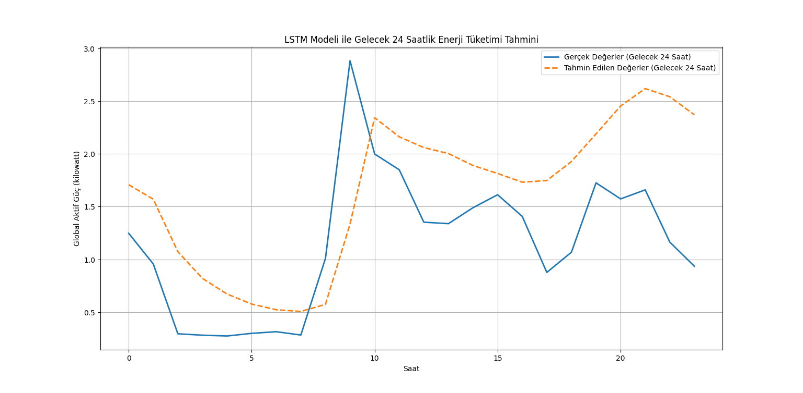
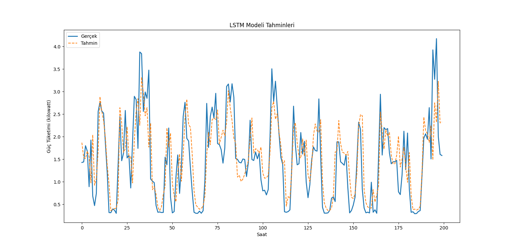
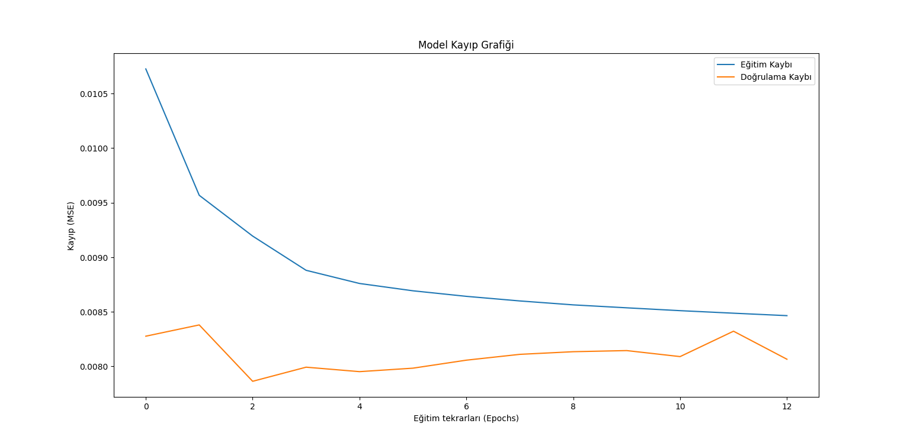
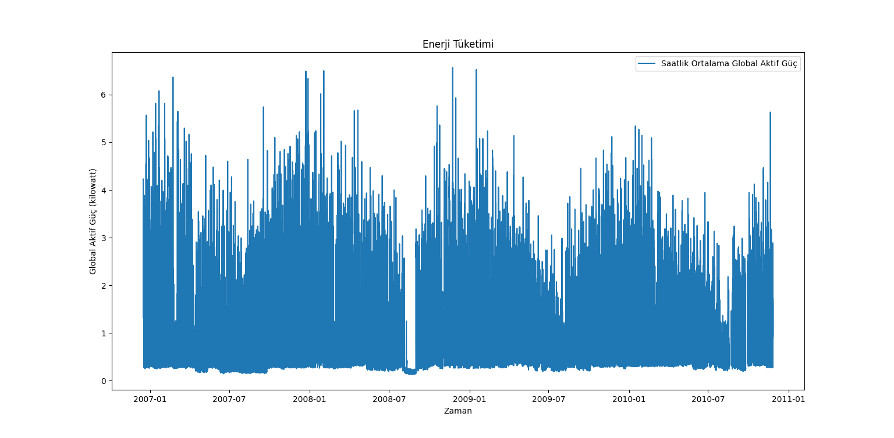

# Individual Household Electric Power Consumption Prediction Using LSTM Time Series

This project focuses on predicting individual household electric power consumption using Long Short-Term Memory (LSTM) neural networks. The dataset used for this project is the "Individual household electric power consumption Data Set" available from the UCI Machine Learning Repository.

## Project Structure

- `1_load_and_clean.py`: Script for loading and cleaning the dataset.
- `2_data_preparation.py`: Prepares the data for training and testing.
- `3_lstm_train.py`: Trains the LSTM model.
- `4_lstm_test.py`: Tests the trained LSTM model.
- `5_forecast_future.py`: Forecasts future power consumption using the trained model.
- `df_hourly.csv`: Processed dataset.
- `household_power_consumption.txt`: Raw dataset.
- `lstm_model.h5`: Saved LSTM model.
- `scaler.save`: Saved scaler for data normalization.
- `X_train.npy`, `X_test.npy`, `y_train.npy`, `y_test.npy`: Numpy arrays for training and testing data.
- `requirements.txt`: List of required Python packages.

## Dataset

The dataset contains measurements of electric power consumption in one household with a one-minute sampling rate over a period of almost 4 years. Different electrical quantities and some sub-metering values are available.

## Requirements

Install the required Python packages using the following command:

```bash
pip install -r requirements.txt
```

## Usage

1. Run `1_load_and_clean.py` to load and clean the dataset.
2. Use `2_data_preparation.py` to prepare the data for training.
3. Train the LSTM model using `3_lstm_train.py`.
4. Test the model using `4_lstm_test.py`.
5. Forecast future power consumption using `5_forecast_future.py`.

## Visualizations

Below are some visualizations generated during the project:

### 1. Forecasting Future Energy Consumption



This graph shows the predicted energy consumption for the next 24 hours using the trained LSTM model. The blue line represents the actual values, while the orange dashed line represents the predicted values.

### 2. LSTM Model Predictions



This graph compares the actual and predicted energy consumption values over a longer time period. The blue line represents the actual values, and the orange dashed line represents the predictions.

### 3. Model Loss Graph



This graph illustrates the training and validation loss of the LSTM model over multiple epochs. The blue line represents the training loss, and the orange line represents the validation loss.

### 4. Energy Consumption Over Time



This graph shows the hourly average global active power consumption over the entire dataset period.

## License

This project is licensed under the MIT License. See the [LICENSE](LICENSE) file for details.

## Author

Barış KAÇİN